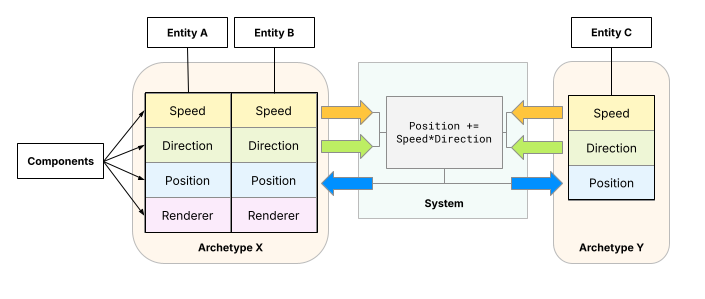

# Entity concepts

An entity represents something discrete in your program that has its own set of data, such as a character, visual effect, UI element, or even something abstract like a network transaction. An entity is similar to an unmanaged lightweight [GameObject](https://docs.unity3d.com/Manual/class-GameObject.html), which represents specific elements of your program. However, an entity acts as an ID which associates individual unique [components](concepts-components.md) together, rather than containing any code or serving as a container for its associated components.

 _Discrete entities labelled Entity A, B, and C._

Collections of entities are stored in a [`World`](xref:Unity.Entities.World), where a world's [`EntityManager`](xref:Unity.Entities.EntityManager) manages all the entities in the world. `EntityManager` contains methods that you can use to create, destroy, and modify the entities within that world. These include the following common methods:

|**Method**|**Description**|
|---|---|
| `CreateEntity` | Creates a new entity.|
| `Instantiate`  | Copies an existing entity and creates a new entity from that copy.|
| `DestroyEntity`| Destroys an existing entity.|
| `AddComponent` | Adds a component to an existing entity.|
| `RemoveComponent`| Removes a component from an existing entity.|
| `GetComponent`| Retrieves the value of an entity's component.|
| `SetComponent`| Overwrites the value of an entity's component.|

>[!NOTE]
>When you create or destroy an entity, this is a **structural change**, which impacts the performance of your application. For more information, see the documentation on [Structural changes](concepts-structural-changes.md)

An entity doesn't have a type, but you can categorize entities by the types of components associated with them. The `EntityManager` keeps track of the unique combinations of components on existing entities. These unique combinations are called archetypes. For more information about how archetypes work, see the documentation on [Archetypes concepts](concepts-archetypes.md). 

## Entities in the Editor

In the Editor, the following icon represents an Entity:  . You’ll see this when you use the specific [Entities windows and Inspectors](editor-workflows.md).

## Additional resources

* [Introduction to systems](systems-intro.md)
* [World concepts](concepts-worlds.md)
* [Archetypes concepts](concepts-archetypes.md)
* [Component concepts](concepts-components.md)